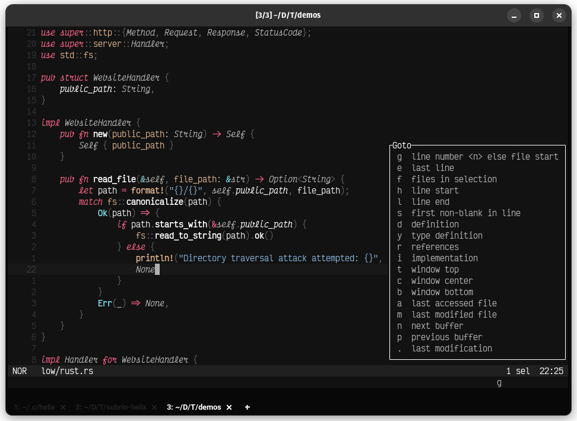
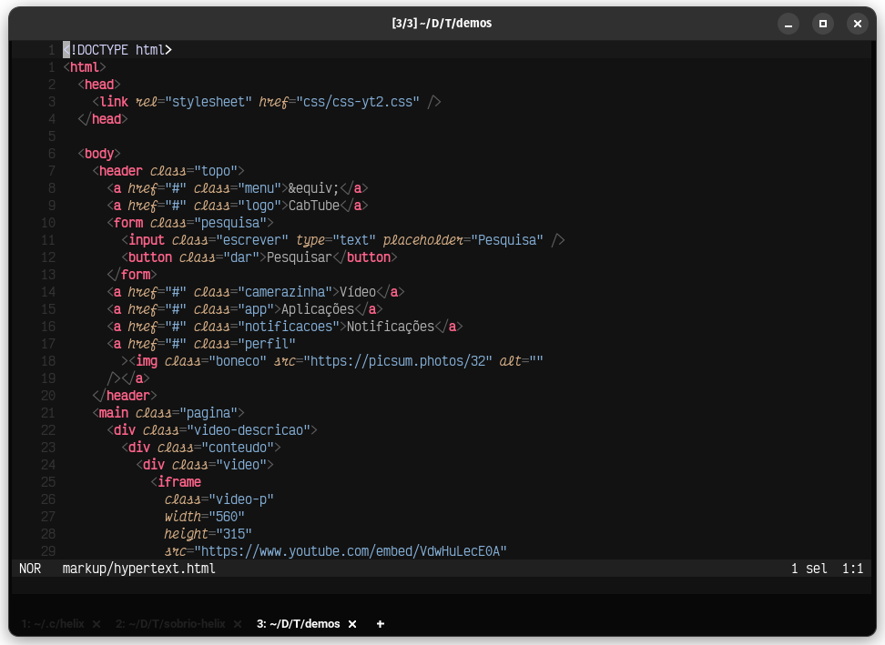

# Sobrio theme for Helix



## About this theme

This is a theme for **Helix**, with sober colors (at least for me), hence the name.
It has support for italic fonts, too. The font used in the screenshots is Victor Mono. For the best experience, make sure your terminal supports at least 256 colors.

---

## Manual installation

To use it, follow these steps:

1. Copy the `themes/sobrio.toml` file to your themes directory, usually `~/.config/helix/themes/`.
2. Set the color scheme: `:theme sobrio`.
3. ???
4. Profit!

---

## Setting it as your default

If you want to make it your default, just add this line to your `config.toml`:

```toml
theme = "sobrio"
```

## Screenshots

### HTML



### Rust


Take care!
